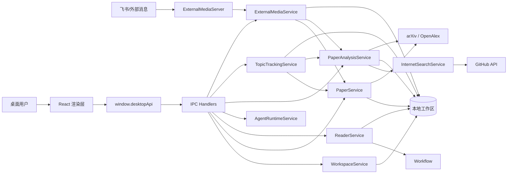

# Vibe Reading 架构设计文档

## 1. 文档目标

本文档基于当前代码实现整理系统级架构设计，覆盖桌面应用分层、核心模块职责、关键交互链路、持久化策略、扩展方式与非功能性考虑，作为后续维护和功能演进的设计基线。

## 2. 系统概述

Vibe Reading 是一个以本地单机为前提的论文阅读与分析桌面应用，技术栈为 Electron + React + TypeScript + LangChain Runtime。系统围绕“论文搜索导入、PDF 阅读批注、单篇论文分析、主题追踪、多任务状态管理、飞书消息接入”构建闭环研究流。

当前实现更偏向“本地研究工作台”而不是“在线协作平台”，核心设计特征如下：

- 主进程承载领域服务与本地文件读写。
- Preload 暴露白名单 API，隔离渲染进程与 Node 能力。
- 渲染层负责页面状态、交互编排与结果展示。
- 数据以 JSON 文件和 PDF 文件形式持久化在本地工作区。
- AI 能力以启发式流程和 LangGraph 状态编排为主，未接入真实大模型推理服务。
- 外部媒体入口以本地 HTTP 服务形式接入飞书消息任务。

## 3. 架构风格

### 3.1 总体风格

系统采用“桌面应用三层架构 + 本地文件存储 + 任务型服务编排”的组合方式：

- 表现层：React 渲染层页面与工作台组件。
- 接入层：Preload API 与 IPC Handler。
- 领域服务层：主进程中的 Workspace、Paper、Reader、Analysis、Topic、External Media、Workflow 等服务。
- 基础设施层：Electron、Node 文件系统、HTTP、第三方开放接口、PDF.js、LangGraph。

### 3.2 设计动机

采用该架构的主要原因：

- 桌面端天然适合本地文件、PDF 与工作区管理。
- 通过 IPC 将 UI 与文件系统能力隔离，降低渲染层安全风险。
- 服务类按业务域拆分，降低模块耦合，便于逐步扩展真实 AI 能力。
- JSON 文件持久化实现成本低，适合首版原型快速交付。
- LangGraph 统一建模任务状态，便于将阅读问答、单篇分析、主题追踪纳入同一执行语义。

## 4. 分层与模块

### 4.1 主进程

主进程负责系统启动、服务装配、工作区初始化、调度器启动、HTTP 外部入口启动以及 IPC 注册。

核心入口：

- `src/main/index.ts`

主要职责：

- 创建 Electron 主窗口。
- 初始化本地工作区目录。
- 装配所有领域服务实例。
- 启动主题调度器。
- 启动外部媒体 HTTP 服务。
- 注册渲染层调用的 IPC 通道。

### 4.2 Preload 层

Preload 层是渲染层与主进程之间的受控桥接层。

核心文件：

- `src/preload/index.ts`

主要职责：

- 使用 `contextBridge.exposeInMainWorld` 暴露 `window.desktopApi`。
- 将所有跨进程调用收敛为固定的 invoke 形式。
- 限制渲染层直接接触 Electron/Node 原生对象。

### 4.3 渲染层

渲染层基于 React + React Router 实现工作台 UI，负责展示和交互，不直接管理底层文件系统。

核心页面：

- 论文库与搜索：`src/renderer/src/App.tsx`
- 阅读器：`src/renderer/src/ReaderPage.tsx`
- 单篇分析工作台：`src/renderer/src/PaperAnalysisWorkbench.tsx`
- 主题追踪工作台：`src/renderer/src/TopicTrackingWorkbench.tsx`

主要职责：

- 首次启动拉取 Bootstrap 数据并建立页面状态。
- 组织论文库筛选、搜索入库、阅读器操作、分析任务触发。
- 展示任务时间线、状态摘要、主题报告与外部接入状态。

### 4.4 领域服务层

#### WorkspaceService

- 管理本地工作区目录结构与基础 JSON 初始化。
- 统一提供工作区绝对路径给其他服务。

#### PaperService

- 对接 arXiv 与 OpenAlex。
- 执行论文检索、下载、入库、更新与删除。
- 输出统一论文库摘要。

#### ReaderService

- 维护单篇论文阅读会话。
- 持久化页码、缩放、批注、笔记、问答历史。
- 调用 AgentRuntimeService 生成阅读问答结果。

#### AgentRuntimeService

- 提供 LangChain Agent 定义。
- 承载示例 Agent 与阅读问答 Agent。
- 统一输出任务状态与时间线。

#### PaperAnalysisService

- 对单篇论文执行结构化分析。
- 聚合阅读上下文与联网检索结果。
- 生成章节化分析档案和代码实验验证记录。
- 支持基于分析档案继续追问。

#### InternetSearchService

- 补充 OpenAlex 相关工作线索。
- 自动发现 GitHub 代码仓库候选。
- 推断依赖文件和候选运行命令。

#### TopicTrackingService

- 管理主题订阅。
- 执行多论文抓取、聚合分析、报告生成与执行历史记录。
- 提供定时轮询调度。

#### ExternalMediaService

- 处理飞书消息协议。
- 将外部请求解析为论文定位与分析任务。
- 持久化请求与状态回调记录。

#### ExternalMediaServer

- 暴露本地 HTTP 协议。
- 提供协议说明、状态查询和飞书消息入口。

## 5. 架构图

## 6. 本地工作区设计

工作区目录由 WorkspaceService 统一初始化，包含如下结构：

- `papers/`：本地 PDF 文件。
- `metadata/`：论文索引、阅读索引、主题订阅等元数据。
- `notes/`：阅读器会话文件。
- `analyses/`：单篇分析报告与主题报告。
- `tasks/`：统一任务状态、主题执行历史、外部媒体请求与回调。
- `cache/`：预留缓存目录。

该设计优点：

- 文件语义清晰，便于定位问题与手工检查。
- 不依赖数据库，迁移和备份简单。
- 每个业务域都有明确落盘位置，方便后续替换为 SQLite 等持久层。

当前约束：

- 缺少事务与并发控制。
- 适合单机单用户，不适合多实例同时写入。

## 7. 关键业务链路

### 7.1 应用启动链路

1. Electron `app.whenReady` 触发启动。
2. 主进程创建 WorkspaceService 和其他业务服务。
3. 初始化本地目录与 JSON 文件。
4. 启动主题调度器和外部媒体 HTTP 服务。
5. 注册 IPC 通道。
6. 创建 BrowserWindow。
7. 渲染层调用 `getBootstrap` 获取首屏快照。

### 7.2 论文搜索与入库链路

1. 搜索页提交关键词。
2. 渲染层通过 Preload 调用 `paper:search`。
3. PaperService 请求 arXiv / OpenAlex。
4. 搜索结果标准化为统一 `PaperSearchResult`。
5. 用户点击导入后调用 `paper:import`。
6. PaperService 下载 PDF、写入论文 JSON、更新论文索引。
7. 返回最新论文库快照给渲染层。

### 7.3 阅读与问答链路

1. 阅读器打开指定论文。
2. ReaderService 加载或创建 `ReaderSession`。
3. 用户翻页、缩放、批注、写笔记时即时持久化。
4. 用户提问后 ReaderService 调用 AgentRuntimeService。
5. AgentRuntimeService 结合摘要、批注、笔记生成回答和任务时间线。
6. 会话历史回写到阅读会话文件。

### 7.4 单篇论文分析链路

1. 用户在 AI 工作台触发单篇分析。
2. PaperAnalysisService 读取论文记录与阅读会话。
3. InternetSearchService 检索相关工作和 GitHub 仓库候选。
4. 生成六个结构化章节。
5. 生成代码实验验证记录。
6. 报告落盘，任务状态更新为完成或失败。

### 7.5 主题追踪链路

1. 用户保存主题订阅，配置检索词、执行时间和抓取上限。
2. TopicTrackingService 手动或定时执行主题分析。
3. 调用 PaperService 抓取并导入新增论文。
4. 选择代表论文集合。
5. 尽量复用已有单篇分析结果补强主题报告。
6. 生成主题综述、方法脉络、共性难点、近期趋势、推荐阅读。
7. 更新主题订阅、任务记录和执行历史。

### 7.6 飞书接入链路

1. 外部系统向本地 HTTP 服务发送飞书消息协议请求。
2. ExternalMediaService 解析消息中的标题、关键词或论文链接。
3. 若本地库不存在目标论文，则自动搜索并导入。
4. 复用 PaperAnalysisService 执行单篇分析。
5. 状态回调依次写入 accepted、running、completed 或 failed。
6. 状态查询接口返回请求详情与回调历史。

## 8. 数据与状态架构

### 8.1 核心实体

- 工作区配置：版本、主题、默认模型。
- 论文记录：元数据、PDF 路径、阅读状态、分析状态、标签等。
- 阅读会话：进度、批注、笔记、问答对话。
- 任务记录：统一工作流状态模型。
- 单篇分析报告：章节、联网结果、代码验证、追问记录。
- 主题订阅：查询词、调度时间、追踪论文列表。
- 主题报告：主题聚合摘要、章节、推荐阅读。
- 外部请求与回调：飞书任务受理和状态回传轨迹。

### 8.2 状态管理策略

- UI 状态主要由 React `useState` 管理。
- 业务真相源在主进程服务与本地文件系统。
- 任务状态统一使用 `AgentTaskRecord` 表达。
- 执行过程用 `AgentTimelineEntry` 描述阶段时间线。

## 9. 非功能性设计

### 9.1 可维护性

- 服务类按业务边界拆分，职责相对清晰。
- 类型集中在 `src/shared/types.ts`，跨层通信协议统一。
- IPC 通道集中在一个注册文件中，便于审计和扩展。

### 9.2 安全性

- 启用 `contextIsolation`，避免渲染层直接访问 Node。
- 第三方仓库不自动执行，代码实验验证只做定位与阻塞说明。
- 外部消息入口仅监听本机地址 `127.0.0.1`。

### 9.3 性能

- JSON 文件读取简单直接，适合中小规模本地数据。
- 搜索采用按需联网请求，未做复杂缓存。
- 主题调度采用固定轮询，复杂度低但不追求毫秒级精度。

### 9.4 可扩展性

后续可沿以下方向演进：

- 将 JSON 文件持久层升级为 SQLite。
- 将启发式问答和结构化分析升级为真实 LLM 调用。
- 为 PaperService 增加更多论文源适配器。
- 为 TopicTrackingService 引入更细粒度调度策略。
- 为 ExternalMediaServer 增加认证、签名校验与更多媒体渠道。

## 10. 当前架构边界与限制

当前代码体现的是可运行原型架构，主要限制如下：

- AI 问答与分析结果仍为规则/模板驱动，不是真实模型推理。
- PDF 阅读器以文本转录与批注记录为主，未实现精确坐标级高亮持久化。
- 缺少数据库事务、用户体系、权限控制和云同步。
- 外部媒体回调目前仅记录本地状态，未真正推送到飞书开放平台。

## 11. 结论

当前架构已经形成从桌面入口到本地工作区、再到分析与外部触发的完整闭环。它以“低依赖、强本地、易扩展”为核心取向，适合作为后续接入真实大模型、数据库与多渠道协同能力的基础版本。
