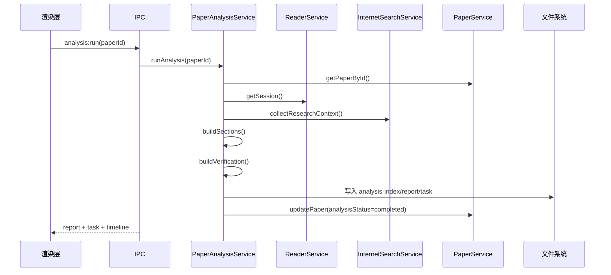
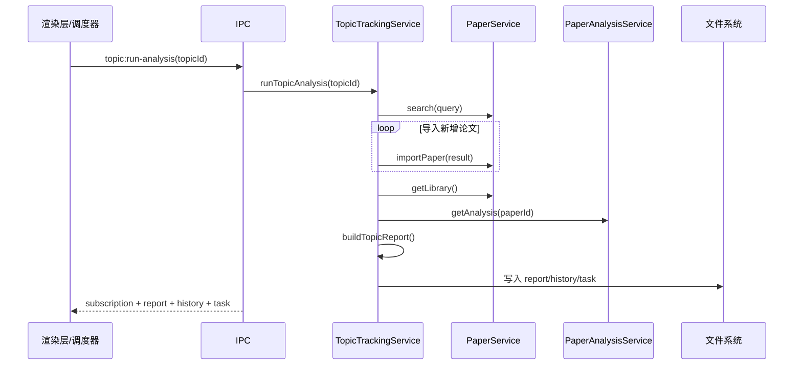

# Vibe Reading 详细设计文档

## 1. 文档范围

本文档面向实现层，基于当前代码说明各核心模块的数据结构、关键方法、执行过程、算法策略、持久化文件与交互接口，帮助开发者快速定位系统行为。

## 2. 启动与装配设计

### 2.1 主入口

主入口位于 `src/main/index.ts`，整体装配顺序如下：

1. 创建 WorkspaceService。
2. 创建 AgentRuntimeService。
3. 创建 PaperService。
4. 创建 ReaderService。
5. 创建 PaperAnalysisService。
6. 创建 TopicTrackingService。
7. 创建 ExternalMediaService。
8. 创建 ExternalMediaServer。
9. 初始化工作区。
10. 启动主题调度器。
11. 启动本地 HTTP 服务。
12. 注册 IPC。
13. 创建主窗口。

该顺序体现了明确的依赖关系：

- ReaderService 依赖 PaperService 与 AgentRuntimeService。
- PaperAnalysisService 依赖 PaperService、ReaderService。
- TopicTrackingService 依赖 PaperService、PaperAnalysisService。
- ExternalMediaService 依赖 PaperService、PaperAnalysisService。

## 3. IPC 设计

### 3.1 通信模式

系统全部采用 `ipcRenderer.invoke` / `ipcMain.handle` 的请求-响应模型，不使用事件推送。优点是：

- 接口清晰，便于管理错误边界。
- 渲染层调用姿势统一。
- 与 TypeScript 类型定义天然适配。

### 3.2 Preload API

`window.desktopApi` 暴露如下能力：

- 启动与论文库：`getBootstrap`、`getLibrary`
- Agent 运行：`runDemoAgent`
- 论文：`searchPapers`、`importPaper`、`updatePaper`、`removePaper`
- 单篇分析：`getPaperAnalysis`、`runPaperAnalysis`、`askPaperAnalysisQuestion`
- 主题追踪：`getTopicTracking`、`saveTopicSubscription`、`deleteTopicSubscription`、`runTopicAnalysis`、`runTopicScheduler`
- 阅读器：`getReaderSession`、`saveReaderProgress`、`addReaderAnnotation`、`removeReaderAnnotation`、`saveReaderNote`、`askReaderAssistant`
- 外部媒体：`getExternalMediaSnapshot`、`simulateFeishuMessage`

### 3.3 IPC Handler 映射

`registerIpcHandlers.ts` 负责将 API 名称绑定到服务方法，特点如下：

- 启动时先 `removeHandler`，避免开发环境热重载导致重复注册。
- `app:get-bootstrap` 会一次性返回首屏所需所有聚合数据。
- 分析、主题、阅读、外部媒体的接口均以业务域为前缀，命名一致性较好。

## 4. 数据模型设计

### 4.1 共享类型层

`src/shared/types.ts` 是系统协议中心，定义了跨层的实体与输入输出模型。

关键设计点：

- 主进程和渲染层共享同一套 TypeScript 类型。
- 所有任务统一使用 `AgentTaskRecord`。
- 所有过程状态统一使用 `AgentTimelineEntry`。
- 阅读会话、单篇分析、主题报告、外部媒体请求的边界清晰。

### 4.2 任务状态模型

状态枚举：

- `idle`
- `queued`
- `running`
- `completed`
- `failed`

适用模块：

- LangGraph 示例任务
- 阅读问答任务
- 单篇论文分析任务
- 主题追踪任务

这意味着 UI 可以复用同一种状态展示模型，而不需要为每个域单独设计任务状态机。

## 5. 工作区与存储设计

### 5.1 目录结构

本地工作区目录结构如下：

```text
workspace/
├── analyses/
│   ├── analysis-index.json
│   ├── reports/
│   └── topic-reports/
├── cache/
├── config.json
├── metadata/
│   ├── papers.json
│   ├── papers/
│   ├── reading.json
│   └── topic-subscriptions.json
├── notes/
│   └── reader-sessions/
├── papers/
└── tasks/
    ├── agent-tasks.json
    ├── external-media-callbacks.json
    ├── external-media-requests.json
    └── topic-history.json
```

### 5.2 初始化策略

WorkspaceService 的核心策略：

- 首次启动时补齐所有目录。
- 所有基础文件使用兜底 JSON 初始值。
- 任何一个 JSON 文件不存在时自动创建，而不是抛错中断启动。

该策略让原型在首次安装、临时目录、冒烟测试环境中都能直接运行。

## 6. PaperService 设计

### 6.1 核心职责

- 统一论文搜索入口。
- 标准化 arXiv 和 OpenAlex 返回结构。
- 下载 PDF 文件并生成本地论文记录。
- 管理论文更新、删除和论文库摘要。

### 6.2 搜索实现

搜索入口支持三种来源：

- `arxiv`
- `openalex`
- `all`

实现策略：

- `arxiv` 通过 XML 接口解析。
- `openalex` 通过 JSON 接口解析，并还原倒排摘要。
- `all` 采用 `Promise.allSettled` 并发请求两个来源。
- 如果至少有一个来源成功，就合并结果；只有全部失败才抛错。

该设计兼顾了可用性和容错性。

### 6.3 入库实现

导入流程：

1. 确保存储目录存在。
2. 读取已有论文索引。
3. 为来源和 sourceId 生成安全文件名。
4. 若存在 PDF 链接则下载 PDF。
5. 构建 `PaperRecord`。
6. 将单篇论文记录写入 `metadata/papers/*.json`。
7. 将汇总记录写回 `metadata/papers.json`。

### 6.4 记录排序与摘要

论文库列表的排序优先级：

1. 重点关注论文优先。
2. 其余按 `updatedAt` 倒序。

论文库摘要包含：

- 总数
- 已下载
- 已索引
- 已收藏
- 已归档

### 6.5 关键限制

- 搜索结果未做本地缓存。
- PDF 下载失败直接抛错。
- 持久化为全量覆盖写入，大数据量下扩展性有限。

## 7. ReaderService 设计

### 7.1 会话模型

每篇论文一个 `ReaderSession`，内容包括：

- 阅读进度
- 批注列表
- 自由笔记
- 问答历史
- 更新时间

### 7.2 进度持久化

`saveProgress` 的关键处理：

- `currentPage` 与 `totalPages` 做最小值保护。
- `zoom` 保留两位小数。
- `completion` 根据页码与总页数计算。
- 同时写入会话文件与全局 `reading.json` 索引。

这保证了：

- 单篇会话可完整恢复。
- 全局阅读统计可快速汇总。

### 7.3 批注设计

批注结构包含：

- 页码
- 引文文本
- 备注
- 颜色
- 创建与更新时间

当前实现特点：

- 批注不依赖 PDF 坐标，仅依赖页码和文本。
- 通过文本匹配高亮当前页转录文本。
- 刷新后仍能恢复批注列表，但不是像专业 PDF 阅读器那样的像素级标注。

### 7.4 阅读问答设计

问答流程：

1. 读取论文记录。
2. 读取阅读会话。
3. 组装用户问题消息。
4. 调用 AgentRuntimeService 的阅读问答流程。
5. 将 AI 回复追加到会话历史。
6. 返回会话、任务、时间线。

## 8. AgentRuntimeService 设计

### 8.1 LangGraph 图结构

当前内置示例图包含三个节点：

- `bootstrapTask`
- `prepareContext`
- `finalizeTask`

边关系：

- `START -> bootstrapTask -> prepareContext -> finalizeTask -> END`

### 8.2 示例工作流

示例工作流的意义不在于真实推理，而在于验证以下基础设施：

- LangGraph 图可执行。
- 统一任务对象可流转。
- 时间线信息可回传到 UI。

### 8.3 阅读问答工作流

虽然 `runReaderQaAgent` 当前仍采用本地确定性拼装，但它复用了统一任务模型，执行步骤如下：

1. 创建阅读问答任务。
2. 提取最近三条批注与笔记片段。
3. 基于论文摘要、批注、笔记组织模板化回答。
4. 返回引用与任务完成态。

这为后续接入真实模型保留了接口和表现层约定。

## 9. PaperAnalysisService 设计

### 9.1 任务执行状态机

单篇分析的主要阶段：

1. 任务排队
2. 整理阅读上下文
3. 联网检索增强
4. 生成结构化章节
5. 结构化输出完成
6. 代码实验验证
7. 分析完成 / 分析失败

### 9.2 报告结构

单篇分析报告包含：

- 基本信息：论文 ID、标题、时间戳
- 搜索查询词
- 阅读上下文摘要
- 六个章节
- 联网命中结果
- 代码实验验证
- 追问对话历史

### 9.3 章节生成算法

`buildSections` 的核心是“摘要句抽取 + 阅读上下文补充”：

1. 将摘要按句子切分。
2. 为每个章节配置关键词集合。
3. 用关键词匹配句子。
4. 若命中不足，则回退到摘要前几句。
5. 生成 `summary`、`bullets`、`evidence`。

六个固定章节：

- 研究动机
- 核心难点
- 研究现状
- 方法介绍
- 实验设置
- 实验结果

### 9.4 联网增强设计

PaperAnalysisService 不直接联网，而是委托 InternetSearchService：

- 输入：当前论文记录
- 输出：相关工作命中、查询词、候选仓库

这种设计保持了分析逻辑和外部检索逻辑的解耦。

### 9.5 代码实验验证设计

当前策略不是执行第三方仓库，而是输出“验证轨迹”：

- 若找不到仓库：标记 `not-found`
- 若找到仓库但受策略限制：标记 `blocked`
- 预留 `verified` 状态给后续真实执行能力

验证步骤标准化为：

- 代码获取
- 依赖检查
- 执行尝试
- 验证结论

### 9.6 追问设计

追问算法采用轻量级关键词匹配：

1. 计算问题与章节标题/摘要/要点的匹配分数。
2. 取分数最高的 1~2 个章节。
3. 若问题涉及代码、实验、复现、仓库等关键词，则额外附带验证结论。
4. 将用户消息和回复写回分析报告。

## 10. InternetSearchService 设计

### 10.1 相关工作检索

查询来源：

- 论文标题
- 从标题与摘要提取的关键词组合

返回结构：

- 标题
- 链接
- 摘要片段
- 来源
- 时间
- 作者

### 10.2 仓库发现策略

优先级如下：

1. 先从论文链接、摘要、PDF 链接中提取显式 GitHub URL。
2. 若没有显式链接，则使用 GitHub 搜索仓库。
3. 命中候选仓库后读取根目录文件。
4. 基于依赖文件推断候选命令。

### 10.3 命令推断规则

当前规则较直接：

- `requirements.txt` / `pyproject.toml` -> `python -m pip install -r requirements.txt`、`python main.py`
- `package.json` -> `npm install`、`npm run start`
- `environment.yml` -> `conda env create -f environment.yml`

这是为了生成“可解释的验证计划”，不是为了高精度复现。

## 11. TopicTrackingService 设计

### 11.1 订阅模型

每个主题订阅包含：

- 名称
- 查询词
- 描述
- 每日执行时间
- 启用状态
- 单次最大抓取数
- 最近执行时间
- 最近结果摘要
- 最近报告路径
- 已关联论文 ID 列表

### 11.2 调度策略

调度器不依赖 cron，而采用固定间隔轮询：

- 默认最短 60 秒检查一次。
- 每轮检查是否到了主题的 `scheduleTime`。
- 同一天若已执行则不重复执行。
- `forceRun` 可跳过时间判断。

优点：

- 依赖少。
- 适用于桌面应用运行期间的轻量调度。

缺点：

- 应用未启动时不会补执行。
- 不适合复杂调度场景。

### 11.3 主题分析流程

执行流程：

1. 创建主题任务与历史记录。
2. 调用 PaperService 搜索候选论文。
3. 导入本地库中不存在的新论文。
4. 基于主题匹配分数选择代表论文。
5. 读取可用的单篇分析结果。
6. 生成主题报告。
7. 更新订阅摘要、执行历史和任务状态。

### 11.4 主题匹配算法

论文匹配分由四部分组成：

- 关键词命中分
- 已追踪论文加分
- 本次搜索结果加分
- 收藏论文加分

这样既考虑主题相关性，也考虑用户已关注上下文。

### 11.5 主题报告结构

主题报告固定输出：

- 主题综述
- 方法脉络
- 共性难点
- 近期趋势
- 推荐阅读

补强来源：

- 优先复用单篇分析中的难点与摘要。
- 若单篇分析缺失，则退回论文摘要句。

## 12. ExternalMediaService / Server 设计

### 12.1 协议分层

协议接入拆分为两层：

- Server：只处理 HTTP 路由、JSON 请求体与状态查询接口。
- Service：只处理业务协议解析、论文定位、任务执行与回调记录。

### 12.2 飞书消息解析

飞书消息解析逻辑支持：

- 标题直输
- 关键词输入
- 携带 arXiv / OpenAlex 链接
- 中英文命令前缀剥离

### 12.3 论文定位策略

定位论文优先级：

1. 在本地论文库内按 ID、标题、链接精确匹配。
2. 若本地无结果，则调用搜索接口。
3. 对搜索结果按标题、链接、来源 ID 做打分。
4. 导入最佳候选。

### 12.4 状态回传设计

状态回传顺序：

- `accepted`
- `running`
- `completed` 或 `failed`

所有状态都持久化到本地文件，便于后续通过 `/external-media/status` 查询。

## 13. 渲染层页面设计

### 13.1 App.tsx

App 作为渲染层壳组件，主要职责：

- 初始化 bootstrap 数据。
- 维护论文库、主题快照、通知条、工作流结果。
- 配置四个页面路由：`/library`、`/search`、`/reader`、`/ai-workbench`。

### 13.2 Library 页面

功能包括：

- 工作区摘要展示
- 本地目录展示
- 论文库统计
- 多维筛选
- 论文状态与标签管理
- 删除与阅读跳转

### 13.3 Search 页面

功能包括：

- 输入查询词和来源
- 显示搜索结果
- 展示标题、作者、摘要、来源和时间
- 一键导入论文库

### 13.4 ReaderPage

阅读页由三部分构成：

- 左侧文档区：PDF 文本转录与高亮
- 中间控制区：翻页、缩放、标注输入
- 右侧侧栏：批注列表、笔记、AI 对话

实现重点：

- 使用 `pdfjs-dist` 读取 PDF。
- 将文本内容抽取为转录片段，而非绘制复杂页面坐标层。
- 批注高亮依赖文本匹配函数。

### 13.5 AI 工作台

工作台承载：

- 单篇论文深度分析面板
- 主题追踪面板
- 工作流注册表
- 任务状态模型
- 演示执行面板

## 14. 关键序列设计

### 14.1 单篇分析时序



### 14.2 主题分析时序



## 15. 失败处理设计

系统主要采用“抛错 + 渲染层通知”模型：

- 服务层发现错误直接抛出 `Error`。
- IPC 会将异常传递给渲染层。
- 渲染层统一通过 notice banner 展示失败信息。

领域内额外处理：

- `PaperService.search(all)` 对单源失败做降级。
- `TopicTrackingService.runTopicScheduler` 对单个主题失败做容错，不阻塞其他订阅。
- `PaperAnalysisService` 在失败时会回写失败任务状态。
- `ExternalMediaService` 会持久化失败回调。

## 16. 测试与验证设计

当前仓库中最重要的自动化验证入口是 `scripts/smoke.ts`，其覆盖了：

- 工作区初始化
- 示例工作流
- 论文搜索与导入
- 论文更新与删除
- 阅读进度、批注、笔记、阅读问答
- 单篇论文分析与追问
- 主题订阅、聚合分析、调度器执行
- 外部媒体 HTTP 协议

该脚本通过 `mockFetch` 模拟 arXiv、OpenAlex、GitHub 与 PDF 下载结果，适合做无界面回归验证。

## 17. 已知技术债

- 持久化仍是文件全量覆盖写入，缺少增量写优化。
- IPC 接口数量逐渐增多，后续可引入按域拆分的注册器。
- 阅读器尚未形成真实页面坐标系标注模型。
- 主题报告与单篇分析仍依赖模板和启发式句抽取。
- 外部媒体能力仍处于本地模拟阶段，未接入真实飞书鉴权与回调。

## 18. 结论

当前详细设计体现出一个“原型可运行、分层清晰、扩展位明确”的桌面研究工具基础版本。即使真实 AI 与数据库尚未接入，模块职责、数据结构、文件布局和执行链路已经足够稳定，可支撑后续迭代。
